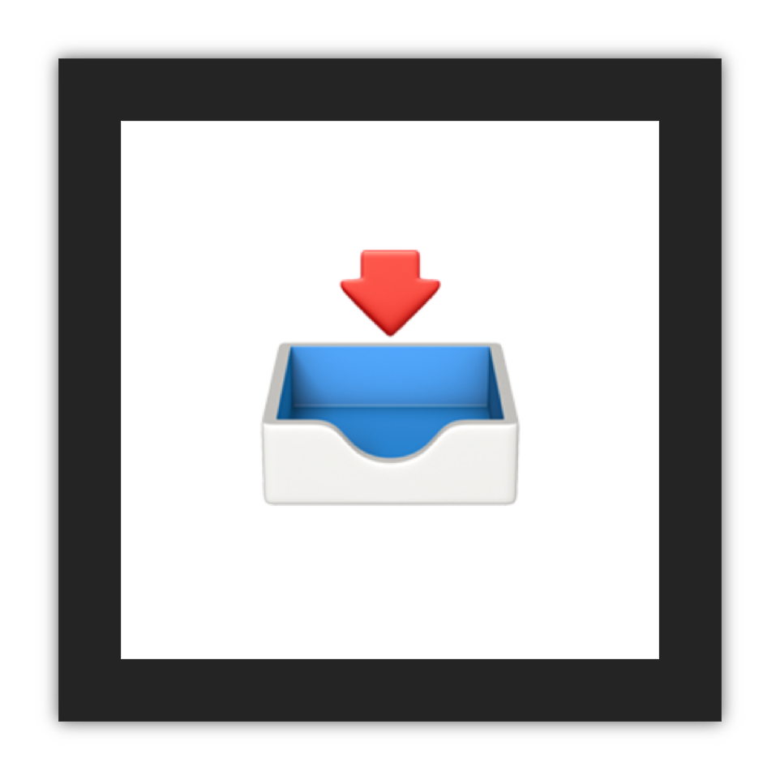

<div align="center">



<br>

# Marchive

The Ultimate Information, News and Media Archiver and Aggregator

<br>

</div>

## Install & Setup for Development

### Install Dependencies

Clone the repo and install dependencies:

```bash
git clone https://github.com/martinshaw/marchive.git marchive
cd marchive
pnpm install
```

### Setup the Development Environment

Run the `setup` script:

```bash
pnpm run setup # also runs `compile`
pnpm run --filter cli pack:mac # or `pack:linux` or `pack:win`
pnpm run --filter electron-app start # or `package` to package the app
```

This will run the `setup` script in each of the packages using NX then it does the same for `compile` scripts.

In effect, this will install a copy of the latest Chromium browser for Puppeteer into the `data-providers` package, then it will compile the TypeScript code in each package into the respective `lib` directories.

### Build the `marchive-cli` Binary

To build the `marchive-cli` binary alongside its Chromium and native module dependencies:

```bash
pnpm run --filter cli pack:mac
```

This will build the `marchive-cli` binary for the macOS platform. If you are running on a different platform, you can replace `mac` with `linux` or `win` to build for the Linux or Windows platform respectively.

### Open the Electron App for Development

To open the Electron app for development, so that change to the code will result in a hot reload:

```bash
pnpm run --filter electron-app start
```

### Build and Package the Electron App for Production

To build and package the Electron app for the local platform:

```bash
pnpm run --filter electron-app package
```

## Monorepo Structure

The Marchive codebase is structured as a [monorepo](https://pnpm.io/workspaces) which separates areas of functionality, eliminate duplicated code and ensures that all functionality is available regardless of the type of process which is accessing the it (e.g. the renderer and main process under the Electron environment, and spawned / forked child processes, cross-process database setup and fast cross-process logging calls).

packages: common-types, common-functions, data-providers, electron-app, database, logger, cli

- [`packages/common-types`](packages/common-types) - The common types package which provides types, interfaces, and enums which are used consistently across the sub-packages. It is important that this package is kept as small as possible and only contains TypeScript types which are used in multiple sub-packages.

- [`packages/common-functions`](packages/common-functions) - The common convenience functions package which provides functions which are used consistently across the sub-packages. It is important that this package is kept as small as possible and only contains JavaScript functions which are used in multiple sub-packages.

- [`packages/data-providers`](packages/data-providers) - The data providers package which provides media scraping and downloading functionality, classes containing strategies to scrape and download media from various sources, and handles the downloading of the Chromium browser for Puppeteer which is copied into the `cli` sub-package during the pack and build process.

- [`packages/cli`](packages/cli) - The CLI package which provides the command line interface for the app, and contains most of the application logic. It is built into a binary which is used to run the app from the command line. Its `utilities:ipc` sub-command and `worker:`-prefixed sub-commands are used by the `electron-app` sub-package (via Node's IPC functionality) to quickly load and store Marchive data.

- [`packages/electron-app`](packages/electron-app) - The Electron app which provides the user interface and manages the app's main and renderer processes under the Electron environment.

- [`packages/database`](packages/database) - The database package which provides a cross-process database setup, migration, model classes, serialized model data types, and TypeOrm ORM-related functionality.

- [`packages/logger`](packages/logger) - The logger package which provides a cross-process logging setup, log level functions, configuration, formatting, and rotation provided by the [Winston](https://github.com/winstonjs/winston) logging library.

- [`packages/utilities`](packages/utilities) - The utilities package which provides a cross-process convenience functions, types, and constants.
